# Kim Seongwon
백엔드 개발자를 목표로 하고 있습니다.  
확장성과 안정성을 갖춘 서비스를 만드는 것에 관심이 있습니다.

## 🚀 주요 활동
- 경북대학교 IT대학 학술동아리 해달 (2023.03 ~ 2024.08)
- 카카오테크캠퍼스 3기 Backend (2025.04 ~ 2025.11)

## 🏆 수상 및 성과
- 2025 한국정보기술학회 추계종합학술대회 대학생 논문경진대회 대상
- 2025 KNU I&T 융합 프로젝트 입상

## 🛠️ 기술 스택
     

## 📊 GitHub 통계

